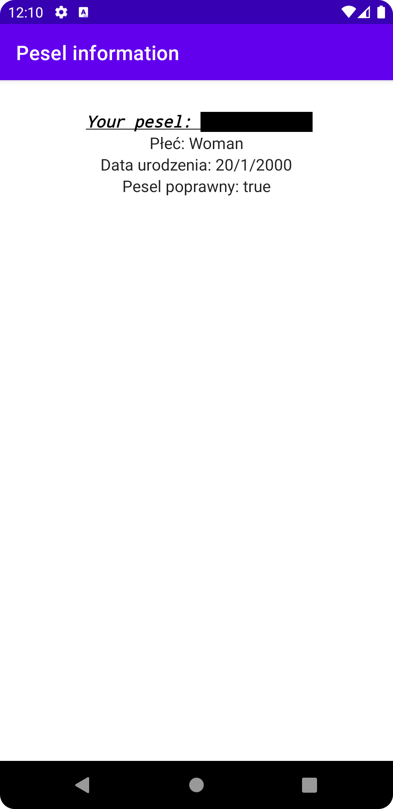

# Pesel Vadlidator
The goal of this simple application is to show how implement list with ViewPager.

## Table of Contents
* [General Info](#general-information)
* [Technologies Used](#technologies-used)
* [Features](#features)
* [Screenshots](#screenshots)
* [Setup](#setup)
* [Project Status](#project-status)
* [Room for Improvement](#room-for-improvement)
* [Contact](#contact)

## General Informationt
The aim of creating this application was to become acquainted with Jetpack Compose toolkit used for building native UI. 
Pesel Validator was created in order to check PESEL (Personal ID Number) number correctness. After entering correct number the app shows owners basic data like date of birth, sex and it's validity. 
In case oof entering incorrect number, the app recognizes it as invalid.

## Technologies Used
- Material Design
- Jetpack Compose

## Features
List the ready features here:
* entering Personal ID Number 
* presenting basic information about the number owner

## Screenshots
Application screenshot review
### Main screen 

	

### Personal information screen 

	

## Setup
1. Download the samples by cloning this repository
2. In the welcome screen of Android Studio, select "Open an Existing project"
3. Select one of the sample directories from this repository

Alternatively, use the `gradlew build` command to build the project directly

## Project Status
Project is: _complete_

## Contact
Created by [@HKonstanty](https://github.com/HKonstanty/HKonstanty) - feel free to contact me!